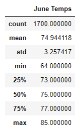
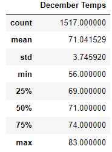
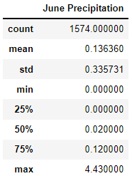
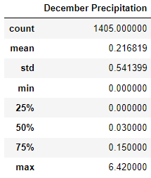

# Surfs Up
## Overview
The purpose of the analysis is to determine the temperature differences between June and December in Oahu to see if it's worth keeping the ice cream store open all year.
## Results
- There is a 4° difference in average temperatures between June and December with June having a mean temperature of ~75° and December having a mean temperature of 71°.
- June has a minimum temperature of 64° and December has a minimum temperature of 56°.
- There is a 4° difference in the Lower Quartiles and the Medians and a 3° difference in the Upper Quartiles between June and December with June having the higher temperatures.

## Summary
The temperatures between June and December generally show that there is only a 4° difference on average when looking at all the data including the quartile data.   
Additionally, when looking at the June and December precipitation data, there is only a 0.080459 difference in inches.  (additional queries in Jupyter Notebook)

xxx
